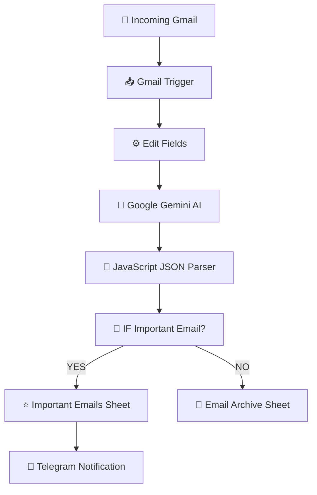

# 📧 AI Email Classifier & Auto Logger — n8n Automation


An intelligent email processing workflow built using **n8n**, **Google Gemini AI**, **Gmail API**, **Google Sheets**, and **Telegram Bot API**.

This system automatically monitors incoming Gmail messages, analyzes email content using AI, classifies emails based on importance and category, stores structured information in Google Sheets, and sends real-time Telegram notifications for high-priority emails.

**Stack:**  
n8n · Gmail API · Google Gemini AI · Google Sheets · Telegram Bot · JavaScript · AI Automation


---

# 🎯 Project Overview


## Problem

Managing large volumes of emails manually creates several challenges:

- Important emails can be missed
- Time wasted reading unnecessary messages
- Difficult email organization
- Manual tracking of important conversations
- Slow response to urgent messages


Common examples:

- Job opportunities
- Client inquiries
- Business requests
- Important notifications


---

## Solution

This project creates an automated AI email triage system by:


1. Monitoring incoming Gmail messages
2. Extracting email information
3. Analyzing emails using Google Gemini AI
4. Classifying email importance and category
5. Generating AI summaries
6. Storing results in Google Sheets
7. Sending Telegram alerts for important emails


The workflow acts as an intelligent assistant that automatically organizes and prioritizes incoming emails.


---

# ✨ Features


## Email Processing

✅ Automatic Gmail monitoring  
✅ Incoming email detection  
✅ Email data extraction  
✅ Automated email classification  


## Artificial Intelligence

✅ Google Gemini AI analysis  
✅ Email category detection  
✅ Priority classification  
✅ AI-generated summaries  
✅ Structured JSON AI output  


## Data Management

✅ Google Sheets email database  
✅ Structured email records  
✅ Automatic organization  
✅ JSON data transformation  


## Notifications

✅ Telegram instant alerts  
✅ Important email notifications  
✅ Real-time workflow monitoring  


---

# 🗺️ System Architecture





---

# 🏗️ Workflow Implementation


# Workflow 1: AI Email Classification Pipeline


## Node 1 — Gmail Trigger


### Purpose

Monitor Gmail inbox for newly received emails.


Configuration:


```text
Event:

Message Received


Label:

INBOX


Polling:

Every Minute
```


Captured Information:


| Field | Description |
|---|---|
| Subject | Email title |
| Sender | Email source |
| Snippet | Email preview |
| Date | Received timestamp |


---

# Node 2 — Edit Fields


### Purpose

Prepare email information before sending it to Google Gemini AI.


Extracted Data:


| Field | Description |
|---|---|
| Subject | Email subject |
| Sender | Email sender |
| Message | Email content preview |
| Date | Email received time |


Example:


```json
{
"subject":
"Admin VA Job Opportunity",

"sender":
"Indeed",

"message":
"Your profile matches this position..."
}
```


---

# Node 3 — Google Gemini AI Agent


### Purpose

Analyze email content and classify the message using artificial intelligence.


The AI determines:


- Email Category
- Priority Level
- Importance Status
- Email Summary


Example Response:


```json
{
"category":
"Job Application",

"priority":
"High",

"important":
true,

"summary":
"Invitation to apply for an Admin VA position."
}
```


---

# Node 4 — Code Node (JSON Parser)


### Purpose

Convert Gemini AI output into structured data for workflow processing.


Processing:


```text
Gemini AI Response

        ↓

JavaScript Parsing

        ↓

Structured Email Data
```


Extracted Fields:


| Field | Description |
|---|---|
| Category | Email type |
| Priority | Importance level |
| Important | Boolean decision |
| Summary | AI-generated summary |


Example Output:


```json
{
"category":
"Job Application",

"priority":
"High",

"important":
true,

"summary":
"Matching job opportunity detected."
}
```


---

# Node 5 — IF Node


### Purpose

Route emails depending on importance.


Condition:


```javascript
important == true
```


## TRUE Branch


Important emails are:

- Saved to Important Emails Sheet
- Sent to Telegram


## FALSE Branch


Normal emails are:

- Saved to Email Archive Sheet


---

# Node 6 — Google Sheets


### Purpose

Store classified email records.


Database Structure:


| Field | Description |
|---|---|
| Timestamp | Processing time |
| Subject | Email title |
| Sender | Email source |
| Category | AI classification |
| Priority | Priority level |
| Summary | AI summary |
| Important | True/False |


Example:


| Subject | Category | Priority |
|-|-|-|
| Admin VA Opportunity | Job Application | High |


---

# Node 7 — Telegram Notification


### Purpose

Send alerts when important emails are detected.


Example:


```text
📧 Important Email Detected


📌 Subject:

Admin VA (Airtable Specialist)


👤 From:

Indeed


📂 Category:

Job Application


⭐ Priority:

High


📝 Summary:

Your background appears to match an Admin VA position.


🤖 Classified automatically using Google Gemini AI.
```


---

# 🔐 Credentials Required


| Service | Purpose |
|---|---|
| Gmail OAuth2 | Read incoming emails |
| Google Gemini API | AI classification |
| Google Sheets OAuth2 | Store email records |
| Telegram Bot API | Notifications |
| n8n Instance | Workflow execution |


---

# ⚙️ Setup Guide


## 1. Configure Gmail Trigger


Create Gmail OAuth credentials.


Required:


```text
Gmail Account

OAuth2 Authentication

Inbox Access
```


Test incoming email detection.


---

## 2. Configure Google Gemini AI


Create Gemini API credentials.


Required:


```text
Google AI API Key

Gemini Model Access
```


Test AI classification response.


---

## 3. Create Google Sheets Database


Create:


```text
Email Classification Records
```


Columns:


```text
Timestamp

Subject

Sender

Category

Priority

Summary

Important
```


---

## 4. Configure Telegram Bot


Steps:


1. Create bot using BotFather
2. Copy bot token
3. Add Telegram credential in n8n
4. Configure chat ID


---

## 5. Import Workflow


Import:


```text
workflow.json
```


Configure:


- Gmail Trigger
- Gemini API
- Google Sheets
- Telegram


Activate workflow.


---

# 🧪 Testing Checklist


| Test Case | Expected Result |
|---|---|
| Receive Gmail message | Workflow starts |
| Gemini analyzes email | Classification generated |
| Code Node executes | JSON created |
| IF Node checks importance | Correct branch selected |
| Google Sheets updates | Record saved |
| Telegram sends message | Notification received |


---

# 📁 Repository Structure


```text
AI-Email-Classifier/

│
├── README.md
│
├── workflow.json
│
├── screenshots/
│   │
│   ├── workflow.png
│   ├── gmail-trigger.png
│   ├── gemini-output.png
│   ├── code-node-output.png
│   ├── if-node-execution.png
│   ├── google-sheets.png
│   ├── telegram-notification.png
│   └── execution-result.png
│
└── LICENSE
```


---

# 📸 Screenshots


Recommended screenshots:


* Complete workflow
* Gmail Trigger configuration
* Gemini AI classification output
* Code Node JSON parsing
* IF Node execution
* Google Sheets records
* Telegram notification
* Workflow execution result


---

# 🚀 Future Improvements


| Feature | Implementation |
|---|---|
| Gmail Auto Labeling | Apply AI-generated labels |
| AI Reply Generation | Create automatic responses |
| Attachment Analysis | Process email files |
| Sentiment Analysis | Detect email tone |
| Priority Scoring | AI-based ranking system |
| Slack Integration | Team notifications |
| Discord Integration | Community alerts |
| Analytics Dashboard | Email insights |
| Notion Integration | Knowledge management |


---

# 🎓 Skills Applied


## Automation

* n8n Workflow Automation
* Event-driven workflows
* Email processing pipelines


## Artificial Intelligence

* Google Gemini API
* Prompt Engineering
* AI classification
* Structured AI output


## APIs

* Gmail API
* Google Sheets API
* Telegram Bot API


## Programming

* JavaScript
* JSON parsing
* Data transformation
* Conditional workflow logic


## Business Automation

* Email management
* Productivity automation
* AI-powered workflow systems


---

# 📚 Learning Objectives


This project demonstrates:


* Building AI-powered automation workflows
* Integrating APIs with n8n
* Processing email data automatically
* Creating structured AI outputs
* Designing business productivity systems


---

# 🙌 Acknowledgements


* n8n
* Google Gemini AI
* Gmail API
* Google Sheets API
* Telegram Bot API


---

# 👨‍💻 Author


**Belio C. Sinangote**

BS Information Technology Student  
Cebu Technological University (CTU)


GitHub:

https://github.com/belioautomation


This project is part of my **30-Day n8n Automation Portfolio**, showcasing practical automation solutions using **n8n, AI integrations, APIs, and business workflow automation**.


---

# 📄 License


MIT License
